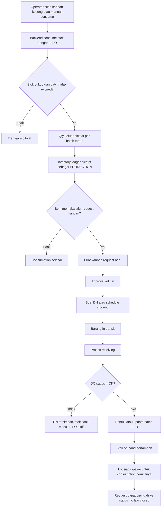
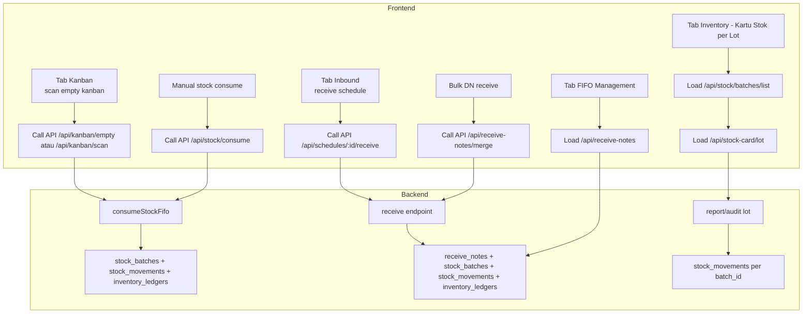
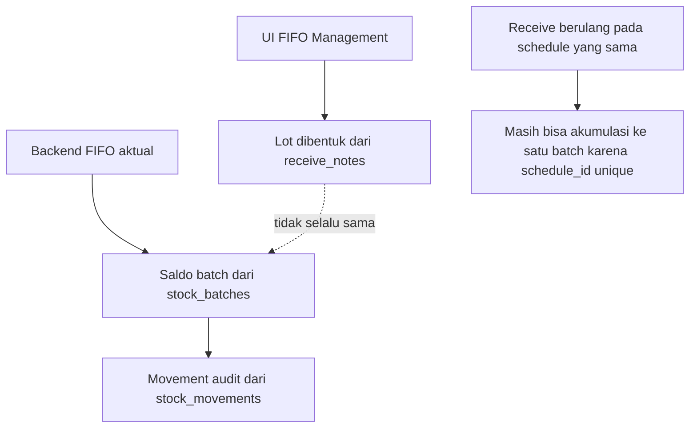

# Diagram Alur FIFO Sistem Saat Ini

Dokumen ini merangkum alur FIFO yang **benar-benar berjalan saat ini** di sistem, dipisahkan menjadi:

- flow bisnis
- flow database
- flow API/UI

Catatan penting:

- Source of truth FIFO operasional ada di `stock_batches` dan `stock_movements`.
- Halaman `FIFO Management` di frontend saat ini adalah read-model yang dibangun dari `receive_notes`, bukan sumber saldo batch riil.
- Kartu stok lot lebih akurat untuk audit FIFO karena membaca pergerakan `stock_movements` per `batch_id`.
- Untuk receipt yang terkait `schedule`, `stock_batches.schedule_id` masih `unique`, sehingga beberapa receipt pada schedule yang sama cenderung terakumulasi ke batch yang sama.

## 1. Flow Bisnis

## 2. Flow Database

```mermaid
flowchart TD
  subgraph Outbound["A. Consumption / Outbound"]
    O1[POST scan kanban kosong atau manual consume] --> O2[Ambil batch tersedia dari stock_batches]
    O2 --> O3[Urutkan sesuai fifo_method]
    O3 --> O4[Cek expired_date]
    O4 --> O5[Update stock_batches.qty_out]
    O5 --> O6[Insert stock_movements direction = out]
    O6 --> O7[Insert inventory_ledgers transaction_type = PRODUCTION]
    O7 --> O8[Insert kanban_requests bila item ikut replenishment]
  end

  subgraph Inbound["B. Receiving / Inbound"]
    I1[POST receive schedule atau DN receive] --> I2[Insert receive_notes atau receive_note_headers/items]
    I2 --> I3{qc_status = ok?}
    I3 -- Tidak --> I4[Simpan dokumen receive saja]
    I3 -- Ya --> I5[Insert atau update stock_batches.qty_in]
    I5 --> I6[Insert stock_movements direction = in]
    I6 --> I7[Update items.qty_on_hand]
    I7 --> I8[Insert inventory_ledgers transaction_type = RECEIVING]
  end

  subgraph Reversal["C. Batalkan / Reversal RN"]
    R1[Reversal RN oleh admin] --> R2[Lock batch terkait]
    R2 --> R3{qty_out batch sudah > 0?}
    R3 -- Ya --> R4[Tolak reversal otomatis]
    R3 -- Tidak --> R5[Kurangi stock_batches.qty_in; set 0 bila habis]
    R5 --> R6[Insert stock_movements reason = receipt_reverse]
    R6 --> R7[Kurangi items.qty_on_hand]
    R7 --> R8[Insert inventory_ledgers transaction_type = REVERSAL]
    R8 --> R9[Update schedule: received_qty berkurang, actual SJ/tanggal kosong bila qty 0]
  end
```

Relasi praktis tabel yang paling berpengaruh ke FIFO:

- `receive_notes` / `receive_note_headers` / `receive_note_items`: dokumen penerimaan.
- `stock_batches`: saldo fisik per batch/lot FIFO.
- `stock_movements`: histori masuk/keluar per batch.
- `inventory_ledgers`: saldo ledger item level.
- `kanban_requests`: permintaan replenishment setelah stok dipotong.
- `items.qty_on_hand`: angka on-hand ringkas di master item.

## 3. Flow API/UI

Penjelasan per layar:

- `Tab Kanban`
  - memicu pengurangan stok FIFO yang riil lewat backend
  - setelah itu bisa membuat `kanban_requests`

- `Tab Inbound`
  - memicu pembentukan batch FIFO saat receiving `qc_status = ok`
  - inilah pintu utama stok masuk ke FIFO aktif

- `Tab FIFO Management`
  - menampilkan lot dari `receive_notes`
  - berguna untuk visual monitoring
  - bukan sumber saldo batch paling akurat

- `Tab Inventory > Kartu Stok per Lot`
  - membaca `stock_batches` dan `stock_movements`
  - ini layar audit FIFO yang paling dekat ke transaksi riil

## 4. Batasan Implementasi Saat Ini

Implikasi:

- bila ingin audit lot yang benar-benar terpakai, gunakan data `stock_batches` + `stock_movements`
- bila ingin tampilan lot per event receipt, implementasi sekarang belum sepenuhnya memecah batch per receipt untuk schedule-linked stock
