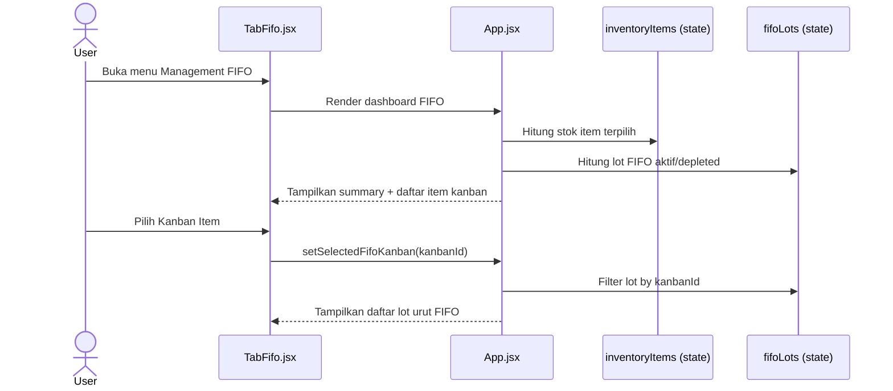
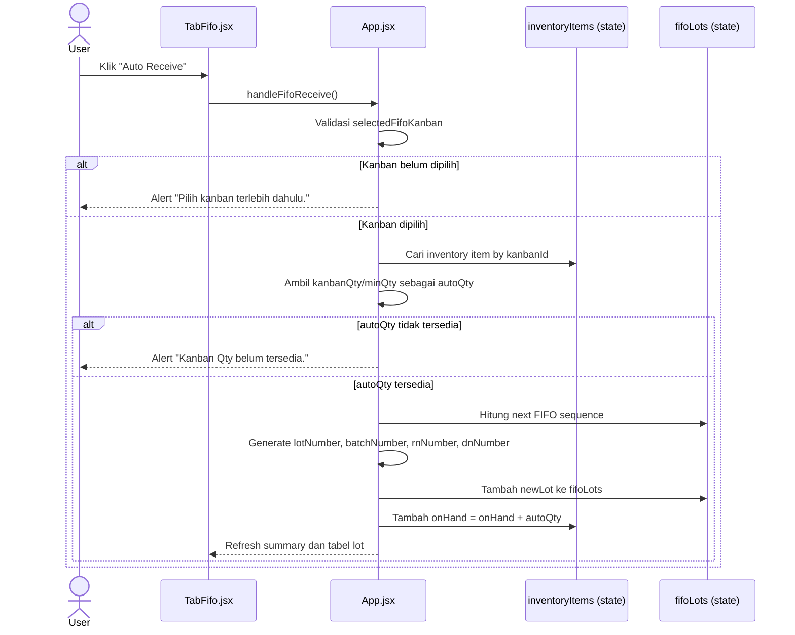
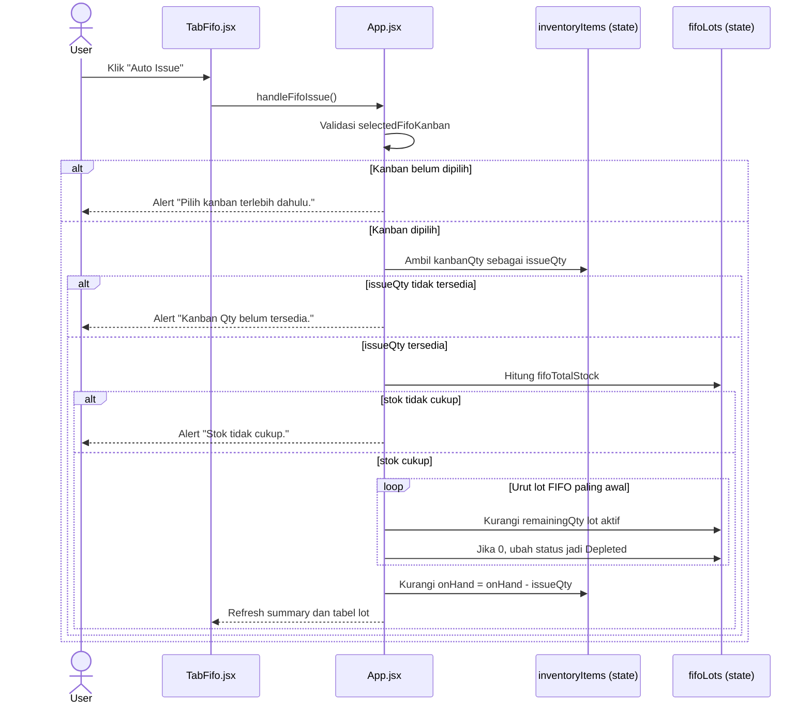
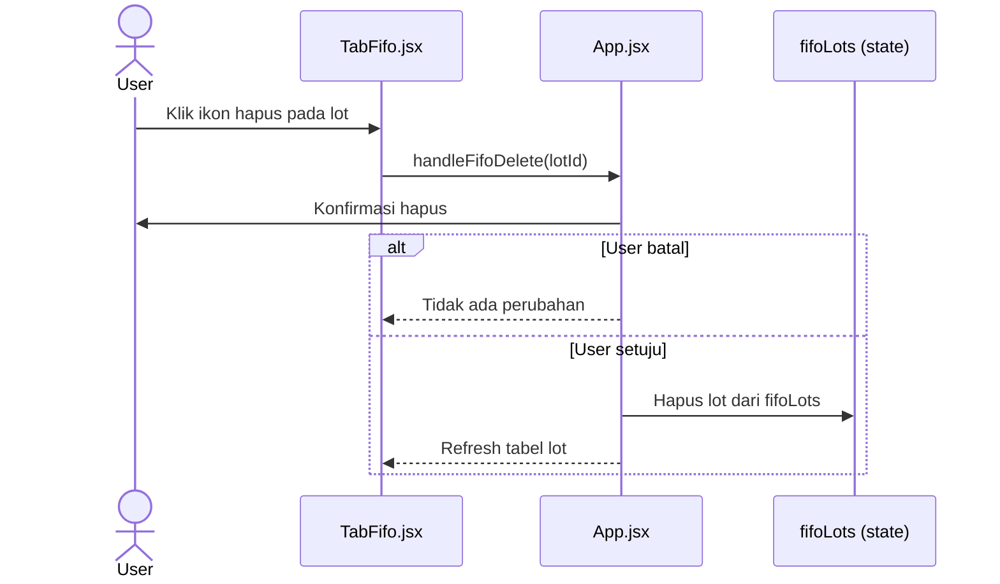

# Sequence Diagram Menu FIFO

Dokumen ini menggambarkan alur aktual menu **Management FIFO** berdasarkan implementasi saat ini.

## Catatan Implementasi

- Menu FIFO dibuka dari tab `Management FIFO`.
- Operasi utama FIFO saat ini adalah:
  - pilih item kanban,
  - `Auto Receive`,
  - `Auto Issue`,
  - hapus lot.
- **Saat ini alur FIFO masih berjalan di state React (`fifoLots`, `inventoryItems`) dan belum memanggil API backend khusus FIFO**.

Referensi utama:
- `src/tabs/TabFifo.jsx`
- `src/App.jsx`

## 1) Sequence Utama Menu FIFO



## 2) Sequence Auto Receive



## 3) Sequence Auto Issue



## 4) Sequence Hapus Lot FIFO



## 5) Alur Status Terkait FIFO di Kanban

Status request yang terkait dengan FIFO di alur kanban:

```text
requested/approved
-> dn_created
-> scheduled
-> in_transit
-> receiving
-> fifo
-> closed
```

Catatan:
- Pada menu Kanban, status `receiving` mengarah ke proses penerimaan.
- Setelah material masuk dan dipakai dalam kontrol stok, status dapat bergerak ke `fifo` lalu `closed`.
- Namun menu `Management FIFO` sendiri saat ini lebih berfungsi sebagai simulasi/operasional berbasis state frontend.
