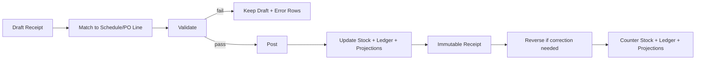

# Inbound Tier-1 Design (Backlog)

Date: 16 March 2026  
Status: Backlog only, not for current sprint execution

## Purpose

Dokumen ini menyimpan desain target untuk inbound ERP Tier-1 yang:
- memisahkan tegas `Plan` vs `Actual`,
- mendukung `Draft -> Validate -> Post -> Reverse`,
- aman untuk audit,
- dan paling minim gesekan dengan implementasi yang sudah hidup sekarang.

Dokumen ini sengaja ditaruh di backlog. Fokus kerja aktif minggu ini tetap:
- restart backend port `4000` dan stabilisasi PowerShell lokal,
- UAT `Report Shortage`,
- quick wins Inventory (`On Hand`, `Reserved`, `Available`),
- quick fix UI/UX yang sudah disepakati.

## Design Principles

1. `schedules` tetap menjadi layer plan/operational reference, bukan sumber immutable actual.
2. Actual inbound harus lahir sebagai dokumen transaksi yang bisa diaudit.
3. Draft tidak boleh mengubah stok, `po_lines`, atau summary schedule.
4. Setelah `Post`, record tidak boleh diedit atau dihapus; koreksi hanya lewat `Reverse`.
5. Perubahan schema harus additive dan aman saat server startup.
6. Endpoint existing harus tetap hidup selama masa transisi.

## Existing Baseline

Berikut baseline yang sudah ada di backend saat ini:

### Plan / operational layer

- `schedules`
  - menyimpan `request_qty`, `arrival_date`, `received_qty`, `status`, `actual_locked`, `po_line_id`, `dn_id`.
- `delivery_notes` dan `delivery_note_items`
  - dipakai untuk alur DN dan bulk receive by DN.
- `inbound_cards`
  - dipakai untuk scan kartu inbound.

### Actual receipt layer yang sudah ada

- `receive_notes`
  - model legacy untuk receive satu item / satu schedule / satu event.
  - dipakai oleh:
    - `POST /api/schedules/:id/receive`
    - `POST /api/delivery-notes/:id/receive`
    - `POST /api/inbound-cards/scan`
- `receive_note_headers` + `receive_note_items`
  - sudah dipakai untuk receive by DN multi-item.
  - saat ini belum punya lifecycle `draft/posted/reversed`.

### Stock effect layer

- `stock_batches`
  - stok fisik/FIFO batch.
  - saat ini masih ada `unique(schedule_id)`, jadi schedule-linked stock cenderung diakumulasi ke satu batch.
- `stock_movements`
  - jejak qty masuk/keluar.
- `inventory_ledgers`
  - jejak ledger inventory dengan tipe transaksi `RECEIVING` dan `REVERSAL`.

### Gap saat ini

1. Receive legacy masih langsung mengubah `schedules`, `stock_batches`, `stock_movements`, dan `inventory_ledgers` dalam satu step.
2. Actual transaction belum punya status formal `draft -> posted`.
3. Record receipt masih bisa dihapus via endpoint admin:
   - `DELETE /api/receive-notes/:id`
   - `DELETE /api/receive-note-headers/:id`
4. Kasus audit masih bergantung pada delete + compensating movement, bukan reversal document formal.
5. `stock_batches.unique(schedule_id)` membatasi model multi-receipt per schedule jika ingin batch per receipt-event.

## Target Operating Model

### Data ownership

- `schedules`, `delivery_notes`, `inbound_cards`
  - referensi plan / execution context.
- `receive_note_headers`, `receive_note_items`
  - canonical actual receipt document.
- `stock_batches`, `stock_movements`, `inventory_ledgers`
  - efek stok dari receipt yang sudah `posted`.
- `po_lines.qty_received`, `schedules.received_qty`, `delivery_notes.status`
  - projection / aggregate hasil posting, bukan sumber utama audit.

### Lifecycle



### Lifecycle rules

#### 1. Draft

- Operator membuat dokumen inbound dari:
  - manual entry,
  - lookup PO,
  - lookup schedule,
  - lookup DN,
  - scan barcode/QR.
- Header dan line masih editable.
- Belum ada write ke `stock_batches`, `stock_movements`, `inventory_ledgers`, `po_lines`, atau `schedules.received_qty`.

#### 2. Validate

- Sistem mengecek line-by-line:
  - supplier konsisten,
  - item valid,
  - `schedule_id` atau `po_line_id` valid,
  - qty valid,
  - outstanding tidak negatif,
  - rule over-receive,
  - `arrival_date` sesuai policy,
  - mandatory field per item lengkap.
- Hasil validasi mengembalikan:
  - `safeRows`,
  - `errorRows`,
  - `warningRows`,
  - `summary`.

#### 3. Post

- Satu draft diposting secara atomic transaction.
- Saat post:
  - header status menjadi `posted`,
  - line status menjadi `posted`,
  - stock effect ditulis,
  - projection table diperbarui,
  - audit log dibuat.
- Setelah `posted`, data bisnis tidak boleh diedit.

#### 4. Reverse

- Koreksi tidak mengubah dokumen posted asli.
- Sistem membuat dokumen reversal yang men-counter qty posted sebelumnya.
- Reversal juga dijalankan atomic.

## Recommended Modeling For Minimal Friction

### Canonical actual document

Gunakan `receive_note_headers` + `receive_note_items` sebagai model canonical untuk flow baru.

Alasannya:
- tabel sudah ada,
- sudah cocok untuk 1 header berisi banyak item,
- sudah dekat dengan kebutuhan multi-SJ / multi-line,
- lebih mudah dipakai sebagai target wrapper untuk endpoint lama.

### Legacy compatibility

`receive_notes` dipertahankan sementara sebagai legacy read/write compatibility layer.

Target akhirnya:
- flow baru menulis ke `receive_note_headers/items`,
- endpoint lama di-wrap ke service baru,
- `receive_notes` bisa tetap diisi sementara jika ada report/UI lama yang masih membacanya,
- setelah report/UI lama pindah, `receive_notes` bisa diturunkan menjadi compatibility view atau deprecated path.

### Schedule-linked stock rule

Untuk fase awal, **tidak perlu** langsung menghapus `unique(schedule_id)` di `stock_batches`.

Aturan kompatibilitas:
- bila line punya `schedule_id`, posting boleh tetap menambah qty ke batch schedule yang sama,
- audit detail receipt tetap disimpan di `receive_note_items`,
- `stock_movements` dan `inventory_ledgers` tetap merekam event per posting,
- jika nanti butuh trace FIFO per truk/per lot yang terpisah, baru masuk fase lanjutan untuk memecah batch storage.

Ini menjaga modul Inventory/FIFO yang sekarang tetap stabil.

## DB Rules (Additive)

### A. `receive_note_headers`

Tambahan kolom yang direkomendasikan:

- `status text not null default 'draft'`
  - check: `draft | validated | posted | reversed`
- `source text null`
  - contoh: `MANUAL`, `LEGACY_SCHEDULE`, `LEGACY_DN`, `INBOUND_SCAN`, `PO_LOOKUP`
- `do_number text not null`
- `document_date date null`
- `po_number text null`
- `duplicate_status text not null default 'unique'`
  - check: `unique | merged_to_existing | duplicate_blocked`
- `posting_error text null`
- `validated_at timestamptz null`
- `validated_by integer null references users(id)`
- `posted_at timestamptz null`
- `posted_by integer null references users(id)`
- `reversed_at timestamptz null`
- `reversed_by integer null references users(id)`
- `reversal_of integer null references receive_note_headers(id)`
- `idempotency_key text null`

Index / constraint:

- partial unique index untuk posted idempotency:
  - `unique (idempotency_key) where status = 'posted' and idempotency_key is not null`
- unique active document identity:
  - `unique (supplier, lower(trim(do_number))) where status in ('draft','validated','posted')`
- index:
  - `(status, created_at desc)`
  - `(reversal_of)`
  - `(po_number)`
  - `(supplier, do_number)`

### B. `receive_note_items`

Tambahan kolom yang direkomendasikan:

- `line_no integer not null default 1`
- `schedule_id integer null references schedules(id) on delete set null`
- `po_line_id integer null references po_lines(id) on delete set null`
- `qc_status text not null default 'ok'`
- `line_status text not null default 'draft'`
  - check: `draft | validated | posted | reversed | error`
- `arrival_date date null`
- `notes text null`
- `posted_qty numeric not null default 0`
- `match_status text not null default 'matched'`
  - check: `matched | over_receipt | mismatch_item | unmatched | held`
- `match_basis text null`
  - contoh: `schedule`, `po_line`, `system_recommendation`, `manual_override`
- `override_reason text null`
- `exception_code text null`
- `reversal_of_item_id integer null references receive_note_items(id)`

Index:

- `(rn_id, line_no)`
- `(schedule_id)`
- `(po_line_id)`
- `(item_code)`
- `(line_status)`
- `(match_status)`

### C. `stock_movements`

Tidak perlu migrasi besar. Cukup additive bila ingin trace lebih presisi:

- `source_ref_type text null`
- `source_ref_id integer null`
- `source_ref_line_id integer null`

Nilai untuk flow baru:
- `source_ref_type = 'inbound_receipt'`
- `source_ref_id = receive_note_headers.id`
- `source_ref_line_id = receive_note_items.id`

### D. `inventory_ledgers`

Tidak wajib ubah kontrak utama, tetapi disarankan tambah metadata:

- `source_ref_type text null`
- `source_ref_id integer null`
- `source_ref_line_id integer null`

Ini akan memudahkan trace:
- receipt posted,
- reversal,
- rekonsiliasi audit.

### E. Projection tables yang tetap dipakai

Flow baru tetap meng-update projection existing berikut saat `post` atau `reverse`:

- `po_lines.qty_received`
- `schedules.received_qty`
- `schedules.status`
- `schedules.arrival_date`
- `delivery_notes.status`
- `items.qty_on_hand`
- `stock_batches.qty_in`

Rule penting:
- projection boleh di-update incremental saat posting,
- tetapi nilai final harus selalu bisa direkonstruksi ulang dari receipt posted + reversal.

## API Contract (Target)

### 1. Draft

`POST /api/inbound/receipts/drafts`

Request:

```json
{
  "doNumber": "SJ-250319-001",
  "source": "MANUAL",
  "supplier": "PT ABC",
  "poNumber": "PO-001",
  "remarks": "Truck 3",
  "truckNo": "B1234CD",
  "driverName": "Joko"
}
```

Response:

```json
{
  "id": 123,
  "status": "draft"
}
```

Rule:
- `doNumber` wajib diisi di header.
- jika ditemukan dokumen aktif dengan `supplier + doNumber` yang sama:
  - bila status `draft/validated`, sistem harus mengembalikan draft existing, bukan membuat header baru,
  - bila status `posted`, sistem harus block dan tampilkan ringkasan dokumen existing.
- create header draft,
- belum boleh mengubah stok/projection.

`POST /api/inbound/receipts/drafts/:id/items`

Request:

```json
{
  "lineNo": 1,
  "itemCode": "ITEM-001",
  "docQty": 100,
  "receivedQty": 100,
  "arrivalDate": "2026-03-16",
  "scheduleId": 456,
  "poLineId": 789,
  "qcStatus": "ok",
  "notes": "Good condition"
}
```

Rule:
- create atau upsert line draft,
- item aktual yang diterima harus ditulis sesuai barang fisik yang datang,
- line tidak boleh dipaksa memakai `scheduleId` milik item lain,
- belum boleh mengubah stok/projection.

### 1A. Recommend Candidate Schedule / PO Line

`GET /api/inbound/receipts/drafts/:id/candidates?lineNo=1`

Response shape:

```json
{
  "lineNo": 1,
  "itemCode": "BR60",
  "supplier": "PT ABC",
  "doNumber": "SJ-250319-001",
  "candidates": [
    {
      "candidateType": "schedule",
      "scheduleId": 987,
      "poNumber": "PO-001",
      "poLineId": 654,
      "itemCode": "BR60",
      "requestDate": "2026-03-16",
      "outstandingQty": 500,
      "score": 100,
      "reason": "same_po_same_item_open_outstanding"
    },
    {
      "candidateType": "po_line_create_schedule",
      "poNumber": "PO-001",
      "poLineId": 655,
      "itemCode": "BR60",
      "remainingQty": 1200,
      "score": 80,
      "reason": "same_po_item_open_but_no_schedule"
    }
  ]
}
```

Recommendation rules:
- hanya cari kandidat dengan `item_code` yang sama dengan barang fisik,
- supplier harus sama dengan supplier header,
- prioritaskan urutan:
  - schedule aktif dengan `PO + item` yang sama dan outstanding masih ada,
  - schedule aktif item yang sama dari supplier yang sama,
  - `po_line` item yang sama yang masih punya remaining tetapi belum punya schedule cukup,
- urutkan kandidat berdasarkan skor dan tampilkan alasan ranking.

### 2. Validate

`POST /api/inbound/receipts/drafts/:id/validate`

Response shape:

```json
{
  "headerStatus": "validated",
  "safeRows": [],
  "errorRows": [],
  "warningRows": [],
  "summary": {
    "totalRows": 0,
    "safeCount": 0,
    "errorCount": 0,
    "warningCount": 0
  }
}
```

Validation rules:
- supplier pada header harus cocok dengan supplier PO/schedule,
- `schedule_id` bila diisi harus cocok item dan supplier,
- bila `schedule_id` kosong, `po_line_id + item_code` wajib resolvable,
- `doNumber` header harus unik pada dokumen aktif untuk supplier yang sama,
- line dengan item aktual berbeda dari item schedule harus gagal validasi,
- line mismatch boleh diteruskan hanya bila user memilih kandidat schedule/po_line yang item-nya sama,
- qty harus `> 0`,
- default block bila receipt melebihi outstanding,
- admin override harus kirim `overrideReason`,
- mismatch item tidak boleh diselesaikan dengan mengubah item schedule target,
- jika tidak ada kandidat schedule, line harus berstatus `held` / `unmatched`, tidak boleh dipost ke stok aktif,
- item posted tidak boleh reference ke schedule yang sudah closed/cancelled,
- duplicate submit dicegah sebelum post.

### 3. Post

`POST /api/inbound/receipts/drafts/:id/post`

Request:

```json
{
  "idempotencyKey": "1e7d8f36-5cb1-4f62-bb78-93f2c14f0b17"
}
```

Post rules:
- wajib berada di transaction `BEGIN ... COMMIT`,
- lock header draft dan line yang relevan,
- lock projection row yang akan berubah (`schedules`, `po_lines`, `delivery_notes`, `stock_batches`),
- untuk line `matched` atau `over_receipt` yang approved, post normal ke stok,
- untuk line `held` / `unmatched` / `mismatch_item`, default tidak ikut post ke stok aktif,
- tulis stock movement + inventory ledger,
- update header/line ke `posted`,
- simpan `posted_at`, `posted_by`,
- respon harus idempotent untuk key yang sama.

### 4. Reverse

`POST /api/inbound/receipts/:id/reverse`

Request:

```json
{
  "reason": "Wrong quantity",
  "idempotencyKey": "9de176ab-32f3-4b22-8d8d-2baf024b0a6a"
}
```

Reverse rules:
- hanya receipt `posted` yang boleh direverse,
- sistem membuat header baru status `posted` dengan relasi `reversal_of`,
- line reversal meng-copy item dari dokumen asal dengan qty lawan,
- stock effect dibalik,
- projection dibalik,
- dokumen asal tetap immutable.

### 5. Query

- `GET /api/inbound/receipts`
- `GET /api/inbound/receipts/:id`
- `GET /api/inbound/receipts/:id/audit`
- `GET /api/inbound/receipts/:id/validation`

## Compatibility Wrapping Strategy

Agar gesekan ke sistem sekarang minimum, endpoint lama jangan langsung diputus.

### Existing endpoints yang dibungkus

- `POST /api/schedules/:id/receive`
- `POST /api/delivery-notes/:id/receive`
- `POST /api/inbound-cards/scan`

### Wrapper behavior

#### Schedule receive

`POST /api/schedules/:id/receive` diubah internalnya menjadi:

1. create receipt draft dengan source `LEGACY_SCHEDULE`,
2. add single draft line dari `schedule_id`,
3. validate,
4. post otomatis,
5. return response shape lama agar frontend existing tidak pecah.

#### Delivery note receive

`POST /api/delivery-notes/:id/receive` diubah internalnya menjadi:

1. create draft header,
2. add draft lines dari item DN,
3. attach scan records bila ada,
4. validate all lines,
5. post satu transaksi atomic,
6. return `status`, `hasOver`, dan payload kompatibel.

#### Inbound card scan

`POST /api/inbound-cards/scan` diubah internalnya menjadi:

1. resolve `card_uid -> schedule_id`,
2. create draft header source `INBOUND_SCAN`,
3. add single draft line,
4. validate,
5. post,
6. update projection card seperti sekarang.

## Business Rules

### Partial receipt

- 1 schedule boleh diterima beberapa kali.
- `schedules.received_qty` adalah akumulasi posted minus reversal.
- status schedule diturunkan dari aggregate:
  - `0` = belum receive,
  - `0 < received < request` = `partial`,
  - `received >= request` = `received/completed` sesuai rule existing.

### 1 SJ, banyak schedule

- 1 header receipt boleh memuat banyak line.
- Setiap line boleh punya `schedule_id` berbeda.
- Post tetap satu transaksi atomic.
- `do_number` hidup di level header, bukan menjadi identitas unik per schedule.
- Satu `do_number` yang sama boleh valid dipakai untuk banyak line dan banyak schedule, selama masih berada dalam satu header receipt yang sama.

### 1 line fisik, ternyata menutup beberapa schedule

Untuk fase awal, pilih model minim friksi:
- sistem split line menjadi beberapa `receive_note_items`,
- masing-masing item mengarah ke satu `schedule_id`,
- hindari many-to-many allocation table di fase awal.

### Over-receive

Default:
- block saat validate/post.

Override:
- hanya role tertentu,
- wajib reason,
- wajib audit trail,
- tetap dibatasi oleh policy yang jelas per line/PO.

### Mismatch item vs schedule

Kasus contoh:
- schedule hari ini: `BR40 = 500`, `BR50 = 500`
- barang datang: `BR40 = 600`, `BR60 = 500`

Aturan:
- `BR40 500` boleh match ke schedule `BR40`.
- `BR40` sisa `100` diperlakukan sebagai `over_receipt`, bukan menutup line lain.
- `BR50 500` tetap outstanding.
- `BR60 500` tidak boleh dipost ke schedule `BR50`.
- `BR60 500` hanya boleh:
  - diarahkan ke schedule lain dengan `item_code = BR60`, atau
  - diarahkan ke `po_line` BR60 yang valid lalu sistem buat / tautkan schedule yang benar, atau
  - masuk `held` bila tidak ada kandidat valid.

Larangan:
- sistem tidak boleh mengganti `item_code` schedule existing agar cocok dengan barang yang datang,
- sistem tidak boleh menganggap item berbeda sebagai substitusi implicit,
- line mismatch item tidak boleh menambah `qty_on_hand` FIFO aktif sebelum ditautkan ke referensi yang sah.

### Schedule recommendation policy

Untuk line mismatch atau line tanpa `schedule_id`, sistem harus merekomendasikan kandidat dengan urutan:

1. schedule aktif item yang sama, supplier yang sama, PO yang sama, outstanding masih ada
2. schedule aktif item yang sama, supplier yang sama, request date terdekat
3. `po_line` item yang sama dengan remaining positif, lalu sistem tawarkan `create schedule from PO line`

Sistem harus menampilkan alasan rekomendasi, misalnya:
- `same_po_same_item_open_outstanding`
- `same_supplier_same_item_nearest_date`
- `open_po_line_no_schedule`

### DO number governance

Tujuan:
- mencegah double input SJ/DO,
- tetap mengizinkan 1 SJ menutup banyak line dan banyak schedule.

Aturan:
- identitas unik receipt adalah `supplier + do_number` di level header.
- jika user input `do_number` yang sudah ada:
  - bila header existing masih `draft` atau `validated`, sistem arahkan user ke dokumen existing,
  - bila header existing sudah `posted`, sistem block create baru dan tampilkan summary dokumen existing,
  - bila user memang sedang melakukan correction, prosesnya harus lewat `reverse` atau `follow-up receipt`, bukan input ulang SJ yang sama.
- `schedule.do_number` boleh tetap disimpan sementara untuk kompatibilitas legacy/read model,
  - tetapi bukan lagi sumber utama validasi duplicate document,
  - nilai ini dianggap turunan dari header / line posting yang relevan.

### Fallback bila tidak ada kandidat valid

- line disimpan sebagai `held` atau `unmatched`,
- stok tidak masuk FIFO aktif,
- dashboard / inbox receiving harus menampilkan exception ini untuk ditindaklanjuti,
- action yang diizinkan:
  - pilih schedule kandidat kemudian validate ulang,
  - pilih `po_line` kandidat lalu generate schedule,
  - reverse / return / reject ke supplier.

### QC status

- `qc_status` disimpan per item line.
- hanya line dengan status yang diizinkan policy yang boleh menambah `qty_on_hand`.
- bila nanti dibutuhkan flow `hold` terpisah, stok hold harus dipisah sebagai backlog lanjutan, bukan dicampur di fase ini.

## Immutability Rules

Setelah `posted`:
- tidak boleh `PUT`,
- tidak boleh `DELETE`,
- tidak boleh ubah qty, item, schedule, PO line, supplier, atau tanggal.

Endpoint delete existing harus diganti strategi perilakunya pada fase implementasi:
- untuk dokumen `draft`: masih boleh delete/cancel,
- untuk dokumen `posted`: harus `409` dan arahkan ke endpoint `reverse`.

## Security and Audit

- Semua endpoint wajib `authenticate`.
- Permission minimum:
  - create/edit draft: `editSchedules`
  - validate/post: `editSchedules`
  - reverse: admin atau role khusus finance/warehouse lead
- Semua event penting dicatat:
  - draft created,
  - draft edited,
  - validation failed,
  - posted,
  - reversed,
  - override over-receive.

Audit minimum menyimpan:
- who,
- when,
- document id,
- before/after status,
- reason / override reason.

## Backend Implementation Breakdown

Tujuan bagian ini adalah menurunkan desain menjadi unit kerja backend yang bisa dieksekusi bertahap tanpa mematahkan flow existing.

### Service split yang direkomendasikan

Pisahkan logika inbound baru ke service internal berikut:

- `createReceiptDraft(client, payload, user)`
  - create atau reuse header draft berdasarkan `supplier + doNumber`
  - isi metadata header
  - return header

- `upsertReceiptDraftLine(client, draftId, payload, user)`
  - insert atau update line draft
  - simpan `itemCode` aktual sesuai barang fisik
  - belum ada efek stok

- `recommendReceiptCandidates(client, draftId, lineNo, user)`
  - baca line draft
  - cari kandidat `schedule` dan `po_line`
  - scoring dan ranking
  - return candidate list + reason

- `validateReceiptDraft(client, draftId, user, options)`
  - validasi semua line
  - hasilkan `safeRows`, `warningRows`, `errorRows`
  - tandai `match_status` per line
  - cek duplicate `doNumber`
  - cek mismatch item, over receipt, supplier mismatch, schedule closed

- `postReceiptDraft(client, draftId, user, options)`
  - lock header dan line
  - lock `schedules`, `po_lines`, `delivery_notes`, `stock_batches`
  - post hanya line yang boleh masuk stok aktif
  - tulis `receive_notes` compatibility bila masih dibutuhkan
  - tulis `stock_movements`, `inventory_ledgers`, `items.qty_on_hand`
  - update projection

- `reverseReceipt(client, receiptId, user, payload)`
  - buat dokumen reversal
  - balik efek stok dan projection
  - jaga immutability dokumen asal

### Endpoint yang perlu dibuat atau diubah

#### A. Draft endpoints baru

- `POST /api/inbound/receipts/drafts`
- `POST /api/inbound/receipts/drafts/:id/items`
- `GET /api/inbound/receipts/drafts/:id/candidates`
- `POST /api/inbound/receipts/drafts/:id/validate`
- `POST /api/inbound/receipts/drafts/:id/post`
- `POST /api/inbound/receipts/:id/reverse`
- `GET /api/inbound/receipts`
- `GET /api/inbound/receipts/:id`
- `GET /api/inbound/receipts/:id/audit`

#### B. Wrapper endpoint existing

- `POST /api/schedules/:id/receive`
  - ubah menjadi wrapper ke `create draft -> add line -> validate -> post`

- `POST /api/receive-notes/merge`
  - ubah menjadi wrapper ke `create draft header -> add many lines -> validate -> post`

- `POST /api/inbound-cards/scan`
  - ubah menjadi wrapper ke draft receipt source `INBOUND_SCAN`

### Detail implementasi per service

#### 1. `createReceiptDraft`

Input minimum:
- `supplier`
- `doNumber`
- `source`
- `poNumber` opsional
- metadata truck / driver / remarks

Langkah:
1. normalize `supplier`, `doNumber`, `poNumber`
2. cari header aktif dengan `supplier + doNumber`
3. bila ada draft existing:
   - return header existing
4. bila ada posted existing:
   - return `409 duplicate document`
5. bila belum ada:
   - insert header draft baru

#### 2. `upsertReceiptDraftLine`

Input minimum:
- `lineNo`
- `itemCode`
- `receivedQty`
- `docQty`
- `scheduleId` opsional
- `poLineId` opsional
- `qcStatus`

Langkah:
1. normalize `itemCode`
2. validasi `receivedQty > 0`
3. bila ada `scheduleId`, jangan trust item schedule:
   - compare item fisik dengan item schedule
   - simpan mismatch sebagai data, bukan auto-correct
4. simpan line draft

#### 3. `recommendReceiptCandidates`

Input:
- `draftId`
- `lineNo`

Query source:
- `schedules` aktif item yang sama
- `po_lines` remaining positif item yang sama
- supplier dari header

Ranking minimum:
1. same supplier + same PO + same item + outstanding positif
2. same supplier + same item + request date terdekat
3. same supplier + same item + open `po_line` walau belum ada schedule

Return:
- `candidateType`
- `scheduleId` atau `poLineId`
- `poNumber`
- `outstandingQty` / `remainingQty`
- `score`
- `reason`

#### 4. `validateReceiptDraft`

Validasi header:
- `supplier` wajib ada
- `doNumber` wajib ada
- cek duplicate active document identity

Validasi line:
- `itemCode` wajib valid di master item
- `receivedQty > 0`
- `qcStatus` valid
- bila `scheduleId` ada:
  - supplier schedule cocok
  - item schedule harus sama
  - schedule belum locked / cancelled / closed
  - outstanding schedule cukup, kecuali override over receipt
- bila `scheduleId` kosong dan `poLineId` ada:
  - `po_line` item harus sama
  - remaining PO line cukup
- bila keduanya kosong:
  - trigger candidate recommendation
  - line jadi `held` atau `unmatched`

Mapping `match_status` minimum:
- `matched`
- `over_receipt`
- `mismatch_item`
- `unmatched`
- `held`

#### 5. `postReceiptDraft`

Urutan posting minimum:
1. `BEGIN`
2. lock header draft
3. validate ulang untuk safety
4. lock semua row target
5. untuk tiap line:
   - bila `match_status in ('held','unmatched','mismatch_item')`:
     - skip stock posting
     - tetap simpan status line dan audit bila policy mengizinkan partial post
   - bila `qc_status` tidak menambah stok:
     - post document line, tapi jangan tambah stok aktif
   - bila line valid untuk stok:
     - tulis compatibility layer `receive_notes` bila dibutuhkan
     - write `stock_batches`
     - write `stock_movements`
     - update `items.qty_on_hand`
     - write `inventory_ledgers`
     - update `po_lines.qty_received`
     - update `schedules.received_qty`, `status`, `arrival_date`
6. update header `posted`
7. `COMMIT`

Keputusan posting yang direkomendasikan:
- default: `partial post allowed`
- artinya line valid boleh posted, line mismatch masuk `held`
- tetapi harus ada warning summary yang jelas ke user

#### 6. `reverseReceipt`

Langkah:
1. lock dokumen posted
2. buat header reversal
3. copy line dengan qty lawan
4. cek batch yang akan dibalik belum conflict
5. tulis reversal movement dan reversal ledger
6. rollback projection
7. mark original linked to reversal

### Candidate recommendation query blueprint

Endpoint recommendation bisa dibangun dari 2 query inti:

- query schedule candidate
  - source: `schedules`
  - filter:
    - `supplier = header.supplier`
    - `item_code = line.item_code`
    - `actual_locked = false` atau masih bisa receive bertahap
    - outstanding positif
    - status bukan `closed/cancelled/rejected`

- query po line candidate
  - source: `po_lines`
  - filter:
    - supplier PO cocok
    - `item_code = line.item_code`
    - `remaining_after_schedule > 0`

Scoring formula minimum:
- `100` = same PO + same item + open schedule
- `80` = same supplier + same item + nearest date
- `60` = same supplier + same item + open PO line no schedule

### Validate response payload yang direkomendasikan

Tambahkan field berikut agar frontend receiving exception mudah dibuat:

```json
{
  "headerStatus": "validated",
  "safeRows": [],
  "warningRows": [],
  "errorRows": [],
  "heldRows": [
    {
      "lineNo": 2,
      "itemCode": "BR60",
      "matchStatus": "held",
      "reason": "no_valid_schedule_candidate",
      "candidateCount": 2
    }
  ]
}
```

### Compatibility policy dengan sistem sekarang

- `receive_notes` legacy tetap diisi sementara untuk flow schedule receive dan reporting existing
- `receive_note_headers/items` menjadi model canonical baru
- `schedule.do_number` tetap boleh diisi sebagai mirror value sementara
- validasi duplicate document dipindah ke `receive_note_headers.do_number`

## Concrete SQL Draft

Bagian ini bukan migrasi final, tetapi baseline SQL additive yang siap dipecah ke `server/index.js` atau file migration.

### 1. Header columns

```sql
alter table receive_note_headers
add column if not exists status text not null default 'draft';

alter table receive_note_headers
add column if not exists source text;

alter table receive_note_headers
add column if not exists do_number text;

alter table receive_note_headers
add column if not exists document_date date;

alter table receive_note_headers
add column if not exists po_number text;

alter table receive_note_headers
add column if not exists duplicate_status text not null default 'unique';

alter table receive_note_headers
add column if not exists posting_error text;

alter table receive_note_headers
add column if not exists validated_at timestamptz;

alter table receive_note_headers
add column if not exists validated_by integer references users(id);

alter table receive_note_headers
add column if not exists posted_at timestamptz;

alter table receive_note_headers
add column if not exists posted_by integer references users(id);

alter table receive_note_headers
add column if not exists reversed_at timestamptz;

alter table receive_note_headers
add column if not exists reversed_by integer references users(id);

alter table receive_note_headers
add column if not exists reversal_of integer references receive_note_headers(id);

alter table receive_note_headers
add column if not exists idempotency_key text;
```

### 2. Header checks and indexes

```sql
do $$
begin
  if not exists (
    select 1
    from pg_constraint
    where conname = 'receive_note_headers_status_check_v2'
  ) then
    alter table receive_note_headers
    add constraint receive_note_headers_status_check_v2
    check (status in ('draft','validated','posted','reversed'));
  end if;
end $$;

do $$
begin
  if not exists (
    select 1
    from pg_constraint
    where conname = 'receive_note_headers_duplicate_status_check'
  ) then
    alter table receive_note_headers
    add constraint receive_note_headers_duplicate_status_check
    check (duplicate_status in ('unique','merged_to_existing','duplicate_blocked'));
  end if;
end $$;

create unique index if not exists idx_receive_note_headers_active_do
on receive_note_headers (lower(trim(supplier)), lower(trim(do_number)))
where do_number is not null and status in ('draft','validated','posted');

create unique index if not exists idx_receive_note_headers_posted_idempotency
on receive_note_headers (idempotency_key)
where idempotency_key is not null and status = 'posted';

create index if not exists idx_receive_note_headers_status_created
on receive_note_headers (status, created_at desc);

create index if not exists idx_receive_note_headers_po_number
on receive_note_headers (po_number);
```

### 3. Item columns

```sql
alter table receive_note_items
add column if not exists line_no integer not null default 1;

alter table receive_note_items
add column if not exists schedule_id integer references schedules(id) on delete set null;

alter table receive_note_items
add column if not exists po_line_id integer references po_lines(id) on delete set null;

alter table receive_note_items
add column if not exists qc_status text not null default 'ok';

alter table receive_note_items
add column if not exists line_status text not null default 'draft';

alter table receive_note_items
add column if not exists arrival_date date;

alter table receive_note_items
add column if not exists notes text;

alter table receive_note_items
add column if not exists posted_qty numeric not null default 0;

alter table receive_note_items
add column if not exists match_status text not null default 'matched';

alter table receive_note_items
add column if not exists match_basis text;

alter table receive_note_items
add column if not exists override_reason text;

alter table receive_note_items
add column if not exists exception_code text;

alter table receive_note_items
add column if not exists reversal_of_item_id integer references receive_note_items(id);
```

### 4. Item checks and indexes

```sql
do $$
begin
  if not exists (
    select 1 from pg_constraint where conname = 'receive_note_items_qc_status_check_v2'
  ) then
    alter table receive_note_items
    add constraint receive_note_items_qc_status_check_v2
    check (qc_status in ('ok','hold','reject'));
  end if;
end $$;

do $$
begin
  if not exists (
    select 1 from pg_constraint where conname = 'receive_note_items_line_status_check_v2'
  ) then
    alter table receive_note_items
    add constraint receive_note_items_line_status_check_v2
    check (line_status in ('draft','validated','posted','reversed','error'));
  end if;
end $$;

do $$
begin
  if not exists (
    select 1 from pg_constraint where conname = 'receive_note_items_match_status_check'
  ) then
    alter table receive_note_items
    add constraint receive_note_items_match_status_check
    check (match_status in ('matched','over_receipt','mismatch_item','unmatched','held'));
  end if;
end $$;

create index if not exists idx_receive_note_items_line_no
on receive_note_items (rn_id, line_no);

create index if not exists idx_receive_note_items_schedule_id
on receive_note_items (schedule_id);

create index if not exists idx_receive_note_items_po_line_id
on receive_note_items (po_line_id);

create index if not exists idx_receive_note_items_match_status
on receive_note_items (match_status);
```

### 5. Movement and ledger metadata

```sql
alter table stock_movements
add column if not exists source_ref_type text;

alter table stock_movements
add column if not exists source_ref_id integer;

alter table stock_movements
add column if not exists source_ref_line_id integer;

alter table inventory_ledgers
add column if not exists source_ref_type text;

alter table inventory_ledgers
add column if not exists source_ref_id integer;

alter table inventory_ledgers
add column if not exists source_ref_line_id integer;
```

### 6. Backfill and compatibility notes

- backfill `receive_note_headers.do_number` dari `delivery_notes.dn_number` atau `receive_notes.rn_number` sesuai source yang paling stabil
- backfill `document_date` dari `created_at::date`
- backfill `line_no` dengan urutan `row_number() over (partition by rn_id order by id asc)`
- backfill `match_status = 'matched'` untuk data lama
- jangan hapus kolom legacy di fase awal

## Rollout Plan

Bagian ini menggantikan rollout high-level menjadi urutan eksekusi yang lebih konkret.

### Phase A1: Additive schema

- tambah kolom header dan item
- tambah constraint dan index baru
- backfill data dasar
- tidak ada perubahan behavior user-facing

Output:
- schema siap dipakai service baru
- tidak ada endpoint existing yang patah

### Phase A2: Internal service extraction

- tambah kolom additive,
- buat service internal:
  - `createReceiptDraft`
  - `validateReceiptDraft`
  - `postReceiptDraft`
  - `reverseReceipt`
- tambah service:
  - `upsertReceiptDraftLine`
  - `recommendReceiptCandidates`
- belum ada perubahan UI besar.

Output:
- backend punya service reusable
- unit test service bisa mulai ditulis

### Phase B1: Duplicate DO governance

- create draft header harus pakai `supplier + doNumber`
- jika `doNumber` aktif sudah ada:
  - reuse draft
  - block posted duplicate
- endpoint `check-sj` diarahkan membaca header baru terlebih dahulu

Output:
- anti double input aktif di model baru
- risiko SJ dobel turun tanpa pecah flow lama

### Phase B2: Wrap legacy endpoints

- endpoint lama dipindah ke service baru,
- response shape lama dijaga tetap kompatibel,
- delete posted receipt mulai diblok dan diarahkan ke reversal.

Prioritas wrapper:
1. `POST /api/schedules/:id/receive`
2. `POST /api/receive-notes/merge`
3. `POST /api/inbound-cards/scan`

Output:
- flow lama tetap hidup
- behavior mismatch dan duplicate DO mulai seragam

### Phase C1: Validation and exception UI

- halaman draft receipt
- validator preview
- section candidate recommendation
- indicator line `held/unmatched/mismatch_item`
- reuse draft bila `doNumber` sudah ada

Output:
- warehouse bisa menangani mismatch tanpa manipulasi schedule

### Phase C2: Audit and reversal UI

- audit trail viewer,
- reversal action.

Output:
- koreksi inbound tidak lagi lewat delete langsung

### Phase D: Optional hardening

- pertimbangkan pecah `stock_batches` per receipt-event bila trace lot per truck dibutuhkan,
- sunset `receive_notes` legacy path,
- rekonstruksi projection by replay untuk audit tooling.

### Suggested sprint slicing

Sprint 1:
- schema additive
- service extraction
- duplicate DO governance

Sprint 2:
- wrapper `schedule receive`
- wrapper `receive-notes/merge`
- backend candidate recommendation

Sprint 3:
- draft UI
- validate UI
- mismatch exception handling

Sprint 4:
- reversal UI
- report/audit hardening
- legacy cleanup planning

## Definition of Done For Future Execution

1. Tidak ada edit atau delete langsung untuk dokumen inbound yang sudah `posted`.
2. Semua koreksi lewat reversal document.
3. `schedules` jelas berperan sebagai plan/projection, bukan actual source of truth.
4. Endpoint lama tetap berjalan selama masa transisi tanpa regression besar.
5. Kasus berikut lolos UAT:
   - partial receipt,
   - multi schedule dalam satu SJ,
   - scan inbound card,
   - DN bulk receive,
   - reversal after post.
6. Audit trace dari receipt ke stock movement dan inventory ledger bisa ditelusuri satu dokumen penuh.

## Explicit Non-Goal For Current Sprint

Tidak ada implementasi backend/UI dari desain ini pada sprint berjalan. Output sprint ini hanya dokumen desain backlog agar batch berikutnya bisa mulai dari baseline yang rapi dan kompatibel.
